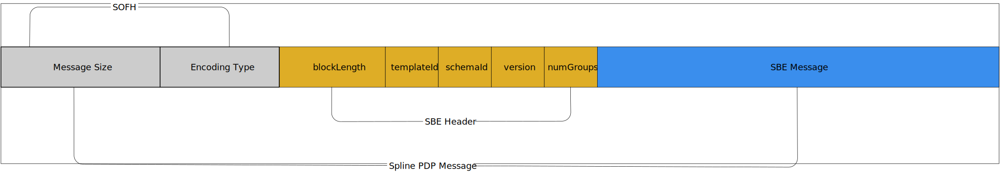

= Spline Data FIX Data
:sectnums:
:sectlinks:
:sectanchors:
:icons: font
:icontype: svg
:toc:
:source-highlighter: pygments
// decent
:pygments-style: xcode
// still kinda dark, looks good in dark reader
:pygments-style: default
// dark style
//:pygments-style: manni
:pygments-linenums-mode: inline
//:stylesheet: dark.css
//:stylesheet: boot-darkly.css
// favorite so far, especially in dark
:stylesheet: adoc-github.css
// this one is pretty good
//:stylesheet: clean.css
:pagenums:
:pdf-version: 1.7
:table-stripes: even
 
<<<

== Spline 1.0 Predictions Data Protocol - SplinePDP

The SplineD FIX Data protocol provides:

* https://www.fixtrading.org/standards/sbe-online/[FIX Simple Binary Encoding (FIX SBE) v2.0RC2] - optimized for low latency of encoding and decoding
* https://[FIX Performance (FIXP) protocol] - simple session layer management
* Standard message sizes, fixed position and leangth fields
* Real-time messaging
* Event Based Processing
* Curve Predictions
* Price/Yield Predictions

<<<

include::fixsbe.adoc[tag=simple_binary_encoding_major]

[[fix_sofh]]
include::fixsbe.adoc[tag=fix_sofh]

=== FIX SBE v2.0 Message Header Modifications

To keep the size of data as minimal as possible, the `messageHeader`
field has had it's sized reduced from 12 to 6 bytes. This is achieved
by reducting templateId, schemaId, version, and numGroups, from 2 octets
to only 1 octet. numVarDataFields has been omitted: variable length
data will be represented by a group of bytes.

Messages are kept to a maximum of 1500 bytes, including transport headers.
This prevents messages from being fragmented by network routers or gateways,
prevents the need for reassembly of fragmented packets, and allows for use
of message based transport layers in the future, for example, UDP or SCTP.

[[sbe_message_encoding_header_label]]
include::fixsbe.adoc[tag=sbe_message_encoding_header]

include::fixsbe.adoc[tag=sbe_message_body]

include::fixsbe.adoc[tag=spline_group_size_encoding_simple]

==== SBE Message Example

The following is an example of the schema used to interpret the SplinePDP Curve message.

[source,xml]
----
include::splinepdp.xml[tag=sbe_message_example]
----

This standard describes how fields are encoded and the general structure of messages.
The content of a message type is specified by a message schema. A message schema tells which
fields belong to a message and their location within a message. Additionally, the metadata describes
valid value ranges and information that need not be sent on the wire, such as constant values.
For SplinePDP Simple Binary Encoding, messages are expressed as an XML, as in https://www.fixtrading.org/standards/sbe-online/#xml-schema-for-sbe-message-schemas[FIX SBE XML Schema for SBE Message Schemas].

== Message Structure

SplinePDP uses <<fix_sofh>> https://www.fixtrading.org/standards/fix-sofh-online/[FIX Simple Open Framing Header(SOFH)] for framing of messages,
with SBE providing encoding and standard SplinePDP message headers. Session level
communication is provided by https://www.fixtrading.org/standards/fixp-online/[FIX Performance Session Layer (FIXP)].

[sidebar]
****
FIX Protocol Ltd. offers the Simple Open Framing Header standard for framing messages
encoded with binary wire formats, such as Simple Binary Encoding. The framing header
provides two pieces of information:
	* Length of the entire message, inclusive of the SOFH.
	* An encoding identifier specific to the encoding used in the message payload.
****

NOTE: The framing standard, FIX SOFH, specifies that the framing header will always be encoded in network byte order [big-endian].

<<<
.Message Structure Overview
[%header,%autowidth]
|===
|Simple Open Framing Header (SOFH) (6 bytes) |SBE Header (6 bytes) |SBE Message (Variable Length)

a|
SOFH Message Length: 4 bytes

* Overall message length including SOFH and headers: supports framing

a|
Block Length: 2 bytes

* Length of the root block of the Message.

a|
Client to Spline Messages

Example:

* Negotiate
* Establish
* Terminate
* UnsequencedHeartbeat

a|
SOFH encoding: 2 bytes

* FIX SBE version 1.0 Little-endian: 0xEB50
* Identifier of the encoding used in the message payload

a|
SBE Template ID: 2 bytes

* Message Template Identifier

a|
Spline to Client Messages

Example:

* Sequence
* NegotiationResponse
* NegotiationReject
* EstablishmentAck
* EstablishmentReject
* Terminate
* SplinePDP Curve Message
* SplinePDP Price and Yield Prediction Message

|
a|
SBE Schema ID: 1 byte

* Identifier of the Message Schema that contains the Template

|

|
a|
SBE schema version: 1 byte

* Version of the Message Schema in which the Message is defined

|

|
a|
No. of Groups: 1 byte

* Number of groups that follow Message body

|

|===

<<<
This diagram shows the structure of an SBE encoded SplinePDP message.

=== Message Structure Outline

==== Wire format of sequence message

Hexadecimal and ASCII representations, SOFH (first 6 bytes)
are big-endian, following bytes are all little-endian.

[source, hexdump]
----
00000000: 0000 0014 eb50 0800 0800 0000 2a00 0000  .....P......*...
00000010: 0000 0000                                ....
----

[%header,cols="3,4,2,2,3,8"]
|===
|Wire Format |Name |Offset |Length |Interpreted value |Notes

6+^| SOFH message length

a| [source, hexdump]
----
00000014
----

|SOFH message length
|0
|4
|20
|

a|
[source, hexdump]
----
eb50
----

|SOFH encoding
|4
|2
|SBE little-endian
|

6+^| SplinePDP SBE Header

a|
[source, hexdump]
----
0800
----

|SBE root block length
|0
|2
|8
a| NOTE: Offset restarts from beginning of header.

a|
[source, hexdump]
----
00
----

|SBE template ID
|2
|1
|8
a|NOTE: template ID is equivalent to message id or tag 35 in FIX tagvalue format.

a|
[source, hexdump]
----
00
----

|SBE schema ID
|3
|1
|0
|

a|
[source, hexdump]
----
00
----

|SBE schema version
|4
|1
|0
|

a|
[source, hexdump]
----
00
----

|No. of groups
|5
|1
|0
|

a|
[source, hexdump]
----
2a000000
----
|FIXP Sequence Message
|0
|8
|42
|Sequence message, aka Sequenced Heartbeat. Next sequence number is 42.
|===

==== Message with a Repeating Group

This is an example of a message with a repeating group. It happens
to be a curve message with a single curve.

*Notes on the message schema*

The message contains:
	* timestamp - indicates the time interval of the curve
	* feature set - Rating, Payment, Coupon, Size, Liquidity
	* the curve yield for tenors in the set of [1..30] inclusive

This data is encoded using composite types.

include::spline_app_messages.adoc[]

<<<
include::fix_session_level.adoc[]
